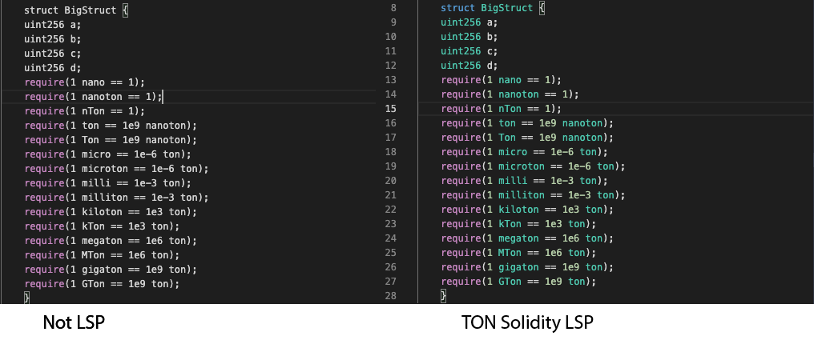

# TON Solidity LSP Example

[](https://marketplace.visualstudio.com/items?itemName=Timuchen.ton-solidity-language-server-bundle) [](https://marketplace.visualstudio.com/items?itemName=Timuchen.ton-solidity-language-server-bundle) [](https://marketplace.visualstudio.com/items?itemName=Timuchen.ton-solidity-language-server-bundle) [](https://marketplace.visualstudio.com/items?itemName=Timuchen.ton-solidity-language-server-bundle#review-details)

The language server will start working immediately after installing the [application](https://marketplace.visualstudio.com/items?itemName=Timuchen.ton-solidity-language-server-bundle&ssr=false#overview).

Solidity is the language used in Free TON to create smart contracts, this extension provides:

- Syntax highlighting
- Snippets
- Compilation of the current contract (Press F1 Solidity : Compile Current Solidity Contract), or F5
- Compilation of all the contracts (Press F1 Solidity : Compile all Solidity Contracts), or Ctrl+F5 / Cmd+F5
- Code completion for all contracts / libraries in the current file and all referenced imports
- Support for different solidity versions (Remote and local)
- Support for unique file extension \* .ton

If your editor does not have this plugin installed, then the Solidity code will look something like this:


Once installed, the TON Solidity syntax will be detected automatically.

Files with \* .ton resolution are supported


By default, it is recommended to write the name of the Ton currency with a capital letter. But you can change this in the server settings.


## Why use a server?

Language Servers can be implemented in any language and run in their own process to avoid performance cost, as they communicate with the code editor through the Language Server Protocol. Furthermore, any LSP-compliant language toolings can integrate with multiple LSP-compliant code editors, and any LSP-compliant code editors can easily pick up multiple LSP-compliant language toolings. LSP is a win for both language tooling providers and code editor vendors!


## Features for developers

If you constantly need to change the server settings or you intend to contribute to development, then install a full-fledged server from the repository.

If you would like to customize the language server to suit your needs, download the server [source code](https://github.com/Timuchen/ton-solidity-language-server).

This Language Server works for plain text file. It has the following language features:

- Completions
- Diagnostics regenerated on each file change or configuration change

It also includes an End-to-End test.

## Application structure

```
.
├── client // Language Client
│   ├── src
│   │   ├── test // End to End tests for Language Client / Server
│   │   └── extension.ts // Language Client entry point
├── package.json // The extension manifest.
├── server // Language Server
│   └── src
│       └── server.ts // Language Server entry point
├── snippets
│   └── ton-solidity.json // Setting the snippets
├── syntaxes
│   └── ton-solidity.json // Setting the syntax
```

## Running the Sample

- Run `npm install` in this folder. This installs all necessary npm modules in both the client and server folder
- Open VS Code on this folder.
- Press Ctrl+Shift+B to compile the client and server.
- Switch to the Debug viewlet.
- Select `Launch Client` from the drop down.
- Run the launch config.
- If you want to debug the server as well use the launch configuration `Attach to Server`
- In the [Extension Development Host] instance of VSCode, open a document in 'plain text' language mode.
  - Type `j` or `t` to see `Javascript` and `TypeScript` completion.
  - Enter text content such as `AAA aaa BBB`. The extension will emit diagnostics for all words in all-uppercase.

## Documentations

Heavily documented sample code for https://code.visualstudio.com/api/language-extensions/language-server-extension-guide
